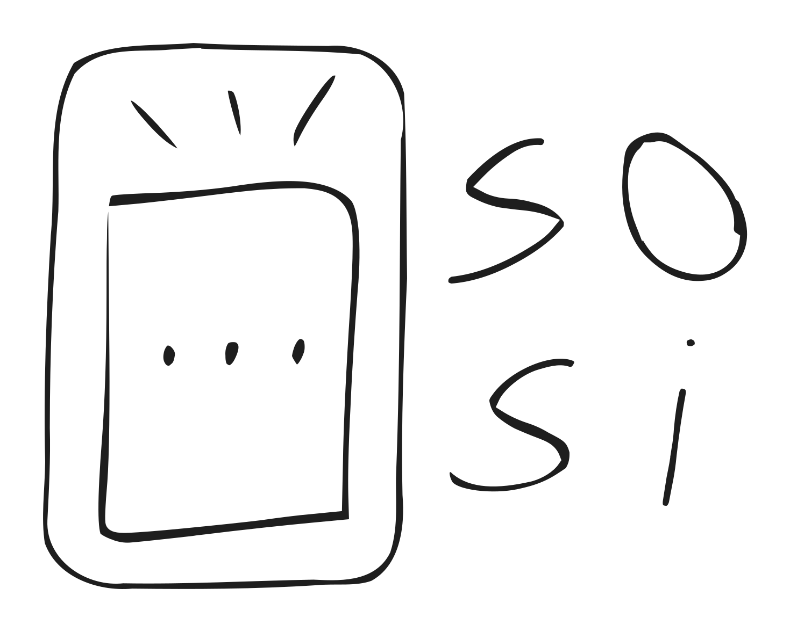

# ilo-musi-sosi

 

A board game similar to [Concept](https://en.wikipedia.org/wiki/Concept_(board_game)), using sitelen pona glyph from the constructed language [toki pona](https://en.wikipedia.org/wiki/Toki_Pona)

[SVGs of sitelen pona in Sonja Lang's handwriting](https://commons.wikimedia.org/wiki/Category:SVGs_of_sitelen_pona_in_Sonja_Lang%27s_handwriting), by LiliCharlie. CC0

[Karumbi](https://smc.org.in/fonts/karumbi) font (used for the logo) is licensed under the SIL Open Font License, Version 1.1. 